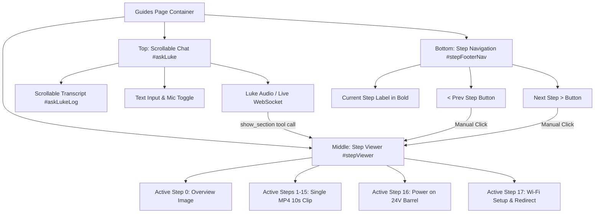

# Requirements

### Overview & Goals
The Luke Robot Arm assembly guide on `lukerobotarm.com` (`#guides`, rename this to `#assembly`) currently presents a long, vertically-scrolling page with 17 stacked video cards, a YouTube embed, and a static power-on text section. This creates too many choices, manual scrolling friction, and distraction for users assembling hardware with tools in hand.

The redesigned assembly guide will do one thing and one thing well: guide the builder step-by-step through an AI voice/chat assistant at the top while displaying **exactly ONE animated video of the current step** below it, with **no page scrolling or extraneous information**.

Builders can listen to Luke speaking automatically, speak into their microphone to confirm step completion (or ask questions), or read the scrollable chat transcript and type in the text input box. The assembly sequence is extended from 15 to **17 steps**, replacing the static bottom text with concrete steps for powering on the robot (Step 16) and setting up the Wi-Fi network (Step 17). A clean, persistent bottom navigation bar allows manual advancement (`< Step 1`, **Step 2**, `Step 3 >`), though manual clicking is optional as speaking to Luke advances the guide hands-free.

Rename all "Guides" to "Assembly": #guides -> #assembly, Guides.html -> Assembly.html, Guides.ts -> Assembly.ts

### Scope
- **In Scope:**
  - **Single-view non-scrolling layout**: Eliminate page scrolling on the assembly guide. Structure the view into top chat, middle current-step animated media, and bottom step navigation bar.
  - **Expanded AI Chat at top**:
    - Automatic greeting by Luke on load ("Hi, I am Luke, I can guide you through the assembly of the robot arm.").
    - Spoken voice audio output if audio is enabled.
    - Expanded, scrollable chat log (`askLukeLog`) so non-voice users can comfortably read instructions and history.
    - Bottom chat row with text input field and microphone toggle button.
  - **Single Step Viewer in middle**:
    - Display only the current step's animated video (`Assembly01.mp4` through `Assembly17.mp4`), overview image (`Assembly00.jpg`)
    - Each 5-10-second animation ends with the confirmation state of that assembly step.
    - Automatically play only the active video in a loop.
  - **17 Sequential Steps**:
    - Steps 1–15: Physical robot assembly.
    - Step 16: Power on the robot (plug 24V power supply brick into barrel jack on back of robot base under white sticker; clear 0.5m calibration radius).
    - Step 17: Wi-Fi setup & connection (switch device to `Luke-<id>` network, configure via `http://192.168.4.1`, redirect to `#connect` Control page).
  - **Bottom Step Navigation Bar**:
    - Left: Previous step button (`< Step 1`, or disabled on first step).
    - Center: Current step label in bold (e.g. **Step 2**).
    - Right: Next step button (`Step 3 >`, or redirect/finish on Step 17).
    - Hands-free advancement when builder speaks completion or Luke triggers `show_section`.
  - **Content & Prompt Synchronization**:
    - Update `src/assembly/luke-assembly-prompt.ts`: fully align with 17 steps, and fix `show_section` call instructions (overview, 1–17).
    - Update `server/luke-chat.mjs`: expand `show_section` tool parameter schema from 1–12 to overview and 1–17.
    - Update `src/assembly/lukeChat.ts`: support 17 steps in `sectionId`, `isGuidesAnchor`, and active step tracking.
  - **Clutter Removal**:
    - Remove the YouTube iframe embed.
    - Remove the 15-item stacked vertical video feed.
    - Remove the bottom "More docs", links, and static text blocks from `#assembly`.
- **Out of Scope:**
  - Re-rendering or editing underlying MP4/JPG binaries (already being re-rendered to 10s with confirmation states).
  - ESP32 firmware code modifications, remove, no need to mention here
  - Adding third-party UI libraries or CSS frameworks

### User Stories
- As a Luke builder with parts on my workbench, I want Luke to greet me and speak each step aloud so that I can assemble the arm hands-free without looking away or scrolling.
- As a builder in a quiet room or without audio output, I want a larger scrollable chat log at the top and a text input box so that I can easily read Luke's instructions and type replies.
- As a builder focusing on the current task, I want to see only the animated video of my current step with its final confirmation state so that I am never confused by earlier or later steps.
- As a builder completing physical assembly, I want explicit Step 16 (24V power connection) and Step 17 (Wi-Fi network configuration) guidance so that I can safely power up and connect my arm.
- As a builder preferring tactile controls, I want prominent previous and next buttons and a bold step counter at the bottom so that I can manually navigate steps at my own pace.

### Functional Requirements
1. **Chat & Voice Header (`#askLuke`):**
   - Automatically initiates session on page load; Luke greets builder with: "Hi, I am Luke, I can guide you through the assembly of the robot arm. Enable your microphone and say start to begin."
   - If audio output is enabled, Luke's spoken voice plays automatically.
   - The chat log (`#askLukeLog`) has increased vertical height (120–160px) and vertical scrolling (`overflow-y: auto`), keeping the latest spoken or typed turn visible while allowing manual history review.
   - The form row (`#askLukeForm`) contains an accessible text input (`#askLukeInput`), an Ask button (`#askLukeSend`), and a microphone toggle button (`#askLukeMic`).
   - Saying or typing completion (e.g. "done", "next", "ready") advances to the next step.

2. **Single-Step Media Stage (`#stepViewer`):**
   - At any time, only ONE step element is visible; all other steps are hidden.
   - Supports 18 discrete states: Overview (0) and Steps 1 through 17.
   - When a step is shown, its video plays (`video.play()`) in a loop; inactive videos are paused and reset to frame 0.
   - Step 16 features clear guidance and visual indication for connecting the 24V DC barrel jack to the back of the base (not USB-C) and establishing a 0.5m clearance safety radius.
   - Step 17 features clear guidance for selecting the `Luke-<id>` Wi-Fi network, configuring credentials via `http://192.168.4.1`, and a direct CTA link to `#connect`.

3. **Bottom Navigation Bar (`#stepFooterNav`):**
   - Fixed at the bottom of the assembly view.
   - Displays three elements:
     - Previous button: `< Step X-1` (or `< Overview` on Step 1; disabled/hidden on Overview).
     - Center indicator: current step name in bold (e.g. `<strong>Step 2</strong>`, `<strong>Step 16: Power on</strong>`, `<strong>Step 17: Wi-Fi Setup</strong>`).
     - Next button: `Step X+1 >` (or `Step 1 >` on Overview; on Step 17, `Go to Control >` navigating to `#connect`).
   - Clicking Previous or Next updates the current step immediately.

4. **Voice & Assistant Synchronization:**
   - When Gemini Live emits a `show_section` tool call, `lukeChat.ts` maps the argument (`overview`, `1`–`17`) to the corresponding step and switches the displayed step instantly.
   - The assistant's contextual awareness (`currentStepLabel`) always queries the active step's `data-step` attribute so Luke remains aware of what the builder is looking at.
   - Direct navigation via hash fragments (`#luke-step-3`, `#luke-step-16`, `#luke-overview`) activates the corresponding step directly.

### Non-Functional Requirements
- **No Page Scrolling:** The entire assembly guide fits within the viewport height on desktop and mobile without triggering page-level vertical scrollbars.
- **Responsiveness:** The layout adapts smoothly from small mobile screens (360px) to desktop monitors. Chat log and video scale proportionally using flexbox and aspect ratio constraints.
- **Performance:** Only the active step's video is played; inactive videos remain paused to conserve CPU/battery and bandwidth.
- **Clean Architecture:** Zero external CSS or JavaScript dependencies; vanilla TypeScript and standard CSS tokens.

# Technical Design

### Current Implementation
- `src/pages/Guides.html`:
  - Contains `#askLuke`, followed by a lead paragraph, YouTube iframe embed, `#luke-overview`, 15 stacked `<section class="assembly-image" id="luke-step-X">` cards, a lengthy `#poweron` section, and a docs link list.
  - Causes long vertical scrolling through 17 separate sections.
- `src/pages/Guides.ts`:
  - Uses an `IntersectionObserver` across all 15 videos to auto-play whichever video is currently 40% visible in the scrollport.
  - Computes `currentStepLabel` by calculating distance from each element's midpoint to the viewport center.
- `src/assembly/luke-assembly-prompt.ts`:
  - Mentioned watching the YouTube video in the greeting.
  - Listed 15 steps with experimental notes for steps 16 and 17.
  - Stated tool calling as `(1=overview till 17=Wi-Fi Settings)`.
- `server/luke-chat.mjs`:
  - Tool definition for `show_section` still documents `1–12` and `poweron`.
- `src/assembly/lukeChat.ts`:
  - Implements `scrollLukeSection` by computing pixel offset `yIn` and setting `scroller.scrollTop`.
  - Maps section IDs for 1–15 only.

### Key Decisions
1. **Single active-card state machine in `Guides.ts` (also rename to `Assembly.ts`):**
   - Maintain an active step index `currentStepIndex` (0 = overview, 1–15 = assembly, 16 = poweron, 17 = wifi).
   - Instead of scrolling `.content`, `showStep(indexOrId)` toggles `.active` on the matching step card (`display: flex/block` vs `display: none`).
   - Pauses all other videos and starts playback on the active step's video.
   - Synchronizes URL hash (`history.replaceState`) and updates bottom navigation labels.
2. **Viewport-locked layout (`.guides-page`):**
   - Style `.guides-page` with `height: 100%; display: flex; flex-direction: column; overflow: hidden;`.
   - Top: `#askLuke` has flex-shrink 0, with `.ask-luke-log` set to `overflow-y: auto; max-height: 140px; min-height: 80px;`.
   - Middle: `#stepViewer` has `flex: 1; min-height: 0; display: flex; align-items: center; justify-content: center; overflow: hidden;`.
   - Bottom: `#stepFooterNav` has flex-shrink 0.
   - Ensures no scrollbar appears on `.content` or `window`.
3. **Dedicated Step 16 and Step 17 cards:**
   - Step 16 (Power on): Prominently highlights the 24V power brick connection to the rear barrel jack (under white sticker), clarifies USB-C is for programming only, and warns of 0.5m calibration sweep.
   - Step 17 (Wi-Fi Setup): Displays direct guidance for selecting `Luke-<id>` in device Wi-Fi settings, captive portal `http://192.168.4.1`, and a button redirecting to `#connect`.
4. **Prompt & Backend Schema Alignment:**
   - Clean up `src/assembly/luke-assembly-prompt.ts`: remove YouTube video mention; standardize greeting; define 17 steps cleanly; clarify `show_section` supports `overview` and `1` through `17`.
   - Update `server/luke-chat.mjs` function declaration to explicitly document `overview, 1..17`.
   - Update `src/assembly/lukeChat.ts` `sectionId()` to map `1`–`17`, `poweron` (step 16), `wifi` (step 17), and `overview`.

### Data Models / Contracts

#### Step Definition Structure in `Guides.ts`
```typescript
interface StepMeta {
  id: string;          // 'luke-overview', 'luke-step-1' ... 'luke-step-17'
  name: string;        // 'Overview', 'Step 1' ... 'Step 17'
  label: string;       // Bold text for center indicator, e.g. 'Step 2' or 'Step 16: Power on'
  dataStep: string;    // Contextual description passed to Gemini Live via getStep()
}

const STEPS: StepMeta[] = [
  { id: 'luke-overview', name: 'Overview', label: 'Overview: Parts', dataStep: 'overview: parts — base, column, arm, top, gripper' },
  { id: 'luke-step-1', name: 'Step 1', label: 'Step 1', dataStep: 'step 1: insert the lead screw into the base' },
  // ... steps 2 to 15 ...
  { id: 'luke-step-16', name: 'Step 16', label: 'Step 16: Power on', dataStep: 'step 16: connect 24V power brick to base' },
  { id: 'luke-step-17', name: 'Step 17', label: 'Step 17: Wi-Fi Setup', dataStep: 'step 17: switch to Luke Wi-Fi network' }
];
```

#### Markup Template (`Guides.html`)
```html
<div class="assembly-wizard">
  <!-- Top: Expanded, scrollable chat -->
  <aside class="ask-luke" id="askLuke">
    <ol class="ask-luke-log" id="askLukeLog">
      <li class="luke">Hi, I am Luke, I can guide you through the assembly of the robot arm.</li>
    </ol>
    <form class="ask-luke-row" id="askLukeForm">
      <button type="button" id="askLukeMic" class="btn-secondary" aria-pressed="false">Enable mic</button>
      <input id="askLukeInput" type="text" placeholder="Type or talk to Luke…" autocomplete="off" />
      <button type="submit" id="askLukeSend" class="btn-primary">Ask</button>
    </form>
    <p class="ask-luke-error" id="askLukeError" hidden></p>
  </aside>

  <!-- Middle: Single active step viewer -->
  <div class="step-viewer" id="stepViewer">
    <div class="step-card active" id="luke-overview" data-step="overview: parts — base, column, arm, top, gripper">
      
    </div>

    <!-- Steps 1 to 15: Single video active at a time -->
    <div class="step-card" id="luke-step-1" data-step="step 1: insert the lead screw into the base">
      <video class="assembly-clip" muted loop playsinline preload="auto" poster="/Assembly01.jpg" width="720" height="720">
        <source src="/Assembly01.mp4" type="video/mp4">
      </video>
    </div>
    <!-- ... steps 2 to 15 ... -->

    <!-- Step 16: Power on -->
    <div class="step-card step-card-info" id="luke-step-16" data-step="step 16: connect 24V power brick to base">
      <div class="step-info-panel">
        <h3>Step 16: Power on the Robot</h3>
        <p>Plug the included 24V power brick into a wall socket, then plug the barrel connector into the back of the base (under the white sticker).</p>
        <p class="hint">Clear a 0.5m (1.6ft) area around the arm for calibration sweep. Note: USB-C is for programming only; motors need 24V.</p>
      </div>
    </div>

    <!-- Step 17: Wi-Fi Setup -->
    <div class="step-card step-card-info" id="luke-step-17" data-step="step 17: switch to Luke Wi-Fi network">
      <div class="step-info-panel">
        <h3>Step 17: Connect to Wi-Fi</h3>
        <p>Open device Wi-Fi settings and select the <strong>Luke-&lt;id&gt;</strong> network.</p>
        <p>The setup portal at <code>http://192.168.4.1</code> will open to configure your home Wi-Fi.</p>
        <div class="cta-row" style="margin-top: 1rem;">
          <a href="#connect" class="cta-button" data-nav="connect">Go to Control Page</a>
        </div>
      </div>
    </div>
  </div>

  <!-- Bottom: Fixed navigation controls -->
  <nav class="step-footer-nav" id="stepFooterNav" aria-label="Assembly Step Navigation">
    <button type="button" class="btn-secondary" id="prevStepBtn" aria-label="Previous step">&lt; Overview</button>
    <span class="step-indicator" id="stepIndicator"><strong>Step 1</strong></span>
    <button type="button" class="btn-primary" id="nextStepBtn" aria-label="Next step">Step 2 &gt;</button>
  </nav>
</div>
```

### Components Affected
- `src/pages/Guides.html`: Replaced entire layout with `.assembly-wizard` (top chat, single-step viewer with steps 0–17, bottom navigation bar). Extraneous iframe, long feed, and docs links removed.
- `src/pages/Guides.ts`: Implemented active step state machine (`showStep`), bottom button event listeners, video playback management, and step dispatching. Removed viewport IntersectionObserver.
- `src/style.css`: Added styles for `.assembly-wizard`, full-height non-scrolling layout, `.step-viewer`, `.step-card`, `.step-footer-nav`, and increased chat log height.
- `src/assembly/luke-assembly-prompt.ts`: Updated greeting to remove YouTube mention, aligned 17 steps, and fixed `show_section` instructions.
- `server/luke-chat.mjs`: Updated `show_section` parameter schema description to cover `overview` and `1`–`17`.
- `src/assembly/lukeChat.ts`: Updated `sectionId()` and `isGuidesAnchor()` to support steps 1–17; wired `scrollLukeSection()` to activate the target step in `Guides.ts`.

### Architecture Diagram


### Risks & Mitigations
- **Video aspect ratio on small screens:** In a full-height non-scrolling container, video could be squeezed or push the footer off-screen on short phone viewports. *Mitigation:* Apply `max-height: 100%; max-width: 100%; object-fit: contain;` inside a flexbox child with `min-height: 0`, and set flexible bounds on chat log.
- **Voice assistant sync with step switcher:** Gemini Live might request a section while user is manually clicking next. *Mitigation:* `showStep()` is idempotent and serves as the single source of truth for both user clicks and `show_section` tool calls.
- **Microphone permission on mobile:** Autoplay policy might block microphone or audio context. *Mitigation:* Audio output is armed on first touch/start; mic toggle provides explicit user gesture if permissions need granting.

# Testing

### Validation Approach
Verify that the assembly guide renders without any page-level scrolling, displays exactly one active step at a time, advances cleanly via voice commands and bottom buttons, and correctly runs backend verification scripts.

### Key Scenarios
1. **Initial Page Load & Greeting:**
   - Open `#assembly`.
   - Verify view fits within the window without vertical page scrollbars.
   - Verify Luke initiates the greeting in the chat log and plays audio if enabled.
   - Verify Overview (Step 0) image is displayed initially, previous button is hidden/disabled, center shows `Overview: Parts`, and next button reads `Step 1 >`.
2. **Step-by-Step Navigation via Buttons:**
   - Click `Step 1 >`: verify Step 1 animated video displays and plays automatically; bottom buttons show `< Overview` | **Step 1** | `Step 2 >`.
   - Click `Step 2 >`: verify Step 2 video loads, Step 1 video is stopped; bottom buttons show `< Step 1` | **Step 2** | `Step 3 >`.
   - Test reverse navigation clicking `< Step 1`: verify Step 1 is restored.
3. **Voice & Text Advancement:**
   - Speak or type "done with step 1" or "ready for next step".
   - Verify Luke advances the step viewer to Step 2 via `show_section` tool call.
   - Verify `currentStepLabel` supplies the active step's data to the model.
4. **Step 16 (Power On) & Step 17 (Wi-Fi):**
   - Navigate to Step 16: verify instructions clearly highlight 24V barrel jack on base rear, 0.5m sweep warning, and USB-C clarification.
   - Navigate to Step 17: verify Wi-Fi setup steps for `Luke-<id>`, portal link `http://192.168.4.1`, and `Go to Control >` button.
   - Click `Go to Control >`: verify redirection to `#connect`.
5. **Chat Log Scrolling & Responsiveness:**
   - Send multiple messages in chat: verify chat log smoothly scrolls vertically without causing the main page to scroll.
   - Resize browser to 375×667 (iPhone SE size): verify all three sections (chat, video, bottom nav) fit neatly without overflowing or page scrolling.

### Edge Cases
- Rapid clicking of next/previous buttons: verify video playback switches smoothly without audio glitches or stuck playback.
- Slow network / pending video: verify poster image displays while video is loading.
- Browser audio output blocked: verify builder can read the full spoken transcript in the chat log.

### Test Changes
- Execute `npm run build` (`tsc && vite build`) to verify TypeScript compilation and asset bundling.
- Execute `npm run luke-chat-check` (`node server/luke-chat.mjs --self-check`) to verify backend session handler and prompt integrity.

# Execution Steps

### ✓ Step 1: Update Assembly Prompts and Backend Schema
- Update `src/assembly/luke-assembly-prompt.ts` with standardized greeting, 17-step script, detailed step knowledge (including steps 16 and 17), and `show_section` documentation for overview and 1..17.
- Update `server/luke-chat.mjs` tool declaration for `show_section` to support `overview` and steps `1`–`17`.
- Run `node server/luke-chat.mjs --self-check` to verify server tests pass.

### ✓ Step 2: Rename Guides to Assembly and Update Routing
- Rename `src/pages/Guides.html` to `src/pages/Assembly.html` and `src/pages/Guides.ts` to `src/pages/Assembly.ts`.
- Update `src/main.ts` to import `Assembly`, map `assembly` in `pageMap`, set `guides` as an alias to `assembly`, and update button references.
- Update `index.html`, `src/pages/loadPage.ts`, and `src/pages/Overview.html` to use `#assembly` / `assemblyBtn`.

### ✓ Step 3: Implement Single-Step Viewer and Navigation Logic
- Update `src/pages/Assembly.html` with `.assembly-wizard` structure containing `#askLuke` chat, `#stepViewer` with 18 discrete step cards (Overview 0, Steps 1–17), and `#stepFooterNav`.
- Update `src/pages/Assembly.ts` with step state machine (`STEPS` definition, `showStep()`, single looping video playback, previous/next button bindings, and cleanup).
- Update `src/assembly/lukeChat.ts` to support 17 steps in `sectionId`, map anchors, and dispatch step changes directly to the viewer.

### ✓ Step 4: Style Viewport-Locked Assembly Page
- Update `src/style.css` to implement non-scrolling layout for `.assembly-page`, full viewport height, flex distribution for chat, media stage, and bottom nav.
- Ensure scrollable `#askLukeLog` (120–160px height) without causing page-level scrollbars.
- Ensure responsive scaling of active video / image across desktop and mobile screens.

### ✓ Step 5: Verification and Final Testing
- Run `npm run build` (`tsc && vite build`) to confirm successful compilation and asset bundling.
- Run `node server/luke-chat.mjs --self-check` to confirm backend consistency.
- Test routing, step state transitions, and anchor navigation.

### ✓ Step 6: Consolidate Steps to 14 Total Across Prompts, Server, Viewer, and Navigation
- Merge Step 1 and 2 (Lead Screw and Coupler, flush surface verification) into Step 1.
- Merge Step 6 and 7 (Cable Chain and Motor Cable) into Step 5.
- Merge Step 13 and 14 (Gripper and Gripper Cable) into Step 11.
- Re-index steps to 12 assembly steps + Power on (Step 13) + Wi-Fi Setup (Step 14) = 14 steps.
- Update `luke-assembly-prompt.ts`, `server/luke-chat.mjs`, `lukeChat.ts`, `Assembly.ts`, and `Assembly.html`.
- Run tests and build checks.

### ✓ Step 7: Simplify Step 13/14 Hints and Enable Step Navigation Speech & Script Fallback
- Simplify Step 13 and 14 hint text in `Assembly.html`, removing titles, extra hints, and duplicate Go to Control buttons.
- Add locale-based translation for Step 13 and Step 14 hints based on `navigator.language`.
- Update `luke-assembly-prompt.ts` with `getStepScript` and exact step 13/14 script wording.
- Update `lukeChat.ts` and `Assembly.ts` so clicking previous/next triggers Luke to keep talking via Gemini Live with previous audio cancellation, or displays the step script if no LLM is available.
- Update `src/style.css` for compact, non-intrusive step hint panels.
- Validate via `npm run build` and `npm run luke-chat-check`.